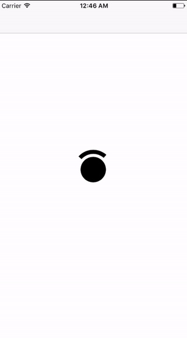

# WinkLoadingView

[](https://travis-ci.org/magyarosibotond/WinkLoadingView)
[](http://cocoapods.org/pods/WinkLoadingView)
[](http://cocoapods.org/pods/WinkLoadingView)
[](http://cocoapods.org/pods/WinkLoadingView)

## Introduction
WinkLoadingView is a loading indicator inspired by Windows® Hello.

## Example

To run the example project, clone the repo, and run `pod install` from the Example directory first or run `pod try WinkLoadingView`.

## Demo



## Installation

### Cocoapods

WinkLoadingView is available through [CocoaPods](http://cocoapods.org). To install
it, simply add the following line to your `Podfile`:

```ruby
use_frameworks!

pod 'WinkLoadingView'
```

Then, run the following command.

```bash
$ pod install
```

### Carthage

Install Carthage if need be.

```bash
$ brew update
$ brew install carthage
```

Add `WinkLoadingView` in your `Cartfile`.

```ruby
github "magyarosibotond/WinkLoadingView"
```

Run `carthage` to build the framework and drag the built `WinkLoadingView.framework` into your Xcode project.

### Manual

Copy `WinkLoadingView` folder to your project. That's it.

## Usage

Start animating.

```swift
loadingView.startLoading()
```

Stop animating.

```swift
activityIndicatorView.finishLoading()
```

**Note:** `finishLoading` will only signal the component to stop animating. Once the methods is called, the component will finish the animation then it will trigger the `animationCompletionHandler` closure.

## License

WinkLoadingView is available under the MIT license. See the LICENSE file for more info.

Windows is a trademark of the Microsoft group of companies.
